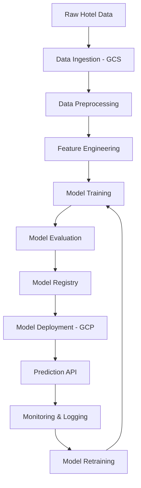

#  Hotel Reservation Cancellation Prediction

<div align="center">
  
  
  
  
  
  
  
  
</div>

---

##  Project Overview


**Welcome to my first MLOps journey!** 🎯 This project represents my initial deep dive into the world of MLOps, where I built a complete end-to-end machine learning pipeline to predict hotel reservation cancellations using Google Cloud Platform.

### 🏨 **Problem Statement**
In the hospitality industry, reservation cancellations can significantly impact revenue and resource planning. This project aims to predict whether a hotel reservation will be cancelled, enabling hotels to:
- Optimize inventory management
- Reduce revenue loss from cancellations  
- Improve customer experience through better planning
- Make data-driven decisions for overbooking strategies

### 🎯 **Business Impact**
- **Revenue Protection:** Early cancellation prediction helps minimize revenue loss
- **Resource Optimization:** Better planning of staff and resources
- **Customer Satisfaction:** Proactive management of room availability
- **Strategic Planning:** Data-driven insights for hotel operations


##  MLOps Architecture

### 🏗️ **Complete Pipeline Components**




##  Tech Stack

### **Cloud Platform**


### **Machine Learning**


### **MLOps Tools**


### **Web App building & Monitoring**


##  Dataset Features

### 📊 **Key Features Used for Prediction:**

| Feature Category | Features | Description |
|------------------|----------|-------------|
| **Booking Info** | `lead_time`, `arrival_date`, `stays_in_week_nights` | Timing and duration details |
| **Guest Details** | `adults`, `children`, `babies` | Party composition |
| **Hotel Info** | `hotel`, `meal`, `room_type` | Service preferences |
| **Booking Channel** | `market_segment`, `distribution_channel` | How booking was made |
| **Historical** | `previous_cancellations`, `previous_bookings_not_canceled` | Guest history |
| **Special Requests** | `special_requests`, `required_car_parking_spaces` | Additional services |

### 🎯 **Target Variable:**
- **`is_canceled`** - Binary classification (0: Not Canceled, 1: Canceled)


## Project Structure

```
MLOPS_PROJECT_1/
├── 📁 artifacts/
│   ├── raw/                    # Raw hotel booking data
│   ├── processed/              # Cleaned and preprocessed data
│   └── models/                 # Saved Model
├── 📁 config/
│   ├── config.yaml/            # Configuration for pipelines
│   ├── model_params.py/        # Model and Hyperparameter Tuning Params
│   └── paths_config.py/        # Paths for storing artifacts
├── 📁 custom_jenkins/
│   └── Dockerfile              # Jenkins image installation
├── 📁 notebooks/
│   └── notebook.ipynb          # Exploratory Data Analysis and model experimentation
├── 📁 pipeline/
│   └── training_pipeline.py/   # Full ML pipeline execution
├── 📁 src/
│   ├── data_ingestion.py       # Data loading and validation
│   ├── data_preprocessing.py   # Data cleaning, preprocessing and feature engineering
│   └── model_training.py       # ML model training and evaluation
├── 📁 static/
│   └── styles.css              # CSS for prediction inference
├── 📁 templates/
│   └── index.html              # Html for prediction inference  
├── 📁 utils/
│   └── common_functions.py     # Utility functions
├── requirements.txt            # Python dependencies
├── setup.py                    # Setup file
├── Dockerfile                  # Container configuration
├── Jenkinsfile                 # Jenkins configuration
└── README.md                   # Project documentation
```


## MLOps Pipeline Stages

### 1️⃣ **Data Ingestion & Storage**

- **Source:** Hotel booking dataset from Kaggle
- **Storage:** Google Cloud Storage buckets
- **Format:** CSV files with automated validation
- **Versioning:** Data versioning using DVC

### 2️⃣ **Data Preprocessing & Feature Engineering**

- **Cleaning:** Handle missing values, outliers, and data inconsistencies
- **Encoding:** Categorical variable encoding (One-hot, Label encoding)
- **Scaling:** Numerical feature normalization
- **Feature Creation:** Derived features like booking patterns, seasonality

### 3️⃣ **Model Training & Experimentation**

- **Algorithms Tested:**
  - Logistic Regression
  - Random Forest
  - XGBoost
  - LightGBM
- **Hyperparameter Tuning:** Random Search
- **Cross-Validation:** 5-fold stratified CV
- **Experiment Tracking:** MLflow for model versioning

### 4️⃣ **Model Evaluation & Selection**

- **Metrics:** Accuracy, Precision, Recall, F1-Score, ROC-AUC
- **Business Metrics:** Cost-sensitive evaluation
- **Model Selection:** Best performing model based on business requirements

### 5️⃣ **Model Deployment**

- **API Development:** Flask for model serving
- **Containerization:** Docker containers for consistency
- **Cloud Deployment:** Google Cloud Run for scalability
- **Load Balancing:** Auto-scaling based on demand


## Model Performance


### 🎯 **Best Model: XGBoost Classifier**

| Metric | Test |
|--------|------|
| **Accuracy** | 86.9% |
| **Precision** | 91.6% |
| **Recall** | 89.2% |
| **F1-Score** | 90.9% |

### 📊 **Feature Importance (Top 10)**
1. **Lead Time** (26.3%) - Days between booking and arrival
2. **No. of special requests** (18.3%) - Special requests made
3. **ADR** (14.9%) - Average Daily Rate
4. **Arrival month** (8.6%) - Month of reservation
5. **Arrival Date** (8.4%) - Date of reservation
6. **Market Segment Type** (5.8%) - Type of rervation
7. **No. of week nights** (4.5%) - No. of week nights for reservation
8. **No. of weekend nights** (3.2%) - Type of customer
9. **Type of meal plan** (2.1%) - Meal plan selected
10. **Room Type reserved** (1.9%) - Room type


## Quick Start

### 🚀 **Local Setup**

```bash
# Clone the repository
git clone https://github.com/aman-yadav-ds/MLOPS_PROJECT_1.git
cd MLOPS_PROJECT_1

# Create virtual environment
python -m venv venv
source venv/bin/activate  # On Windows: venv\Scripts\activate

# Install dependencies
pip install -e .

# Set up environment variables and i am not providing for reasons known to everyone.
export GOOGLE_APPLICATION_CREDENTIALS="path/to/your/service-account-key.json"

```

### 🔄 **Run the Complete Pipeline**

```bash
# 1. Excute whole pipeline
python pipeline/training_pipeline.py

# 2. Start the API server
python application.py
```


## Key Learnings & Insights

### 🧠 **Technical Learnings**
- **MLOps Fundamentals:** Understanding the complete ML lifecycle
- **Cloud Integration:** Hands-on experience with GCP services
- **Model Monitoring:** Implementing drift detection and performance tracking
- **Containerization:** Docker for ML model deployment

### 📈 **Business Insights**
- **Lead Time Impact:** Bookings made far in advance have higher cancellation rates
- **Seasonality Effects:** Summer months show different cancellation patterns
- **Customer Segments:** Corporate bookings have lower cancellation rates
- **Pricing Sensitivity:** Higher ADR correlates with increased cancellations
- **Deposit Policy:** No-deposit bookings have 3x higher cancellation rates

### 🎯 **MLOps Best Practices Learned**
- **Version Everything:** Data, code, models, and experiments
- **Monitoring is Critical:** Real-time performance and drift detection
- **Documentation:** Comprehensive documentation for reproducibility
- **CI/CD for ML:** Automated deployment and rollback strategies


## Future Enhancements

### 🚀 **Planned Improvements**
- **Deep Learning Models:** Implement neural networks for better accuracy
- **Real-time Streaming:** Process bookings in real-time with Apache Kafka
- **A/B Testing Framework:** Test different models in production
- **Advanced Monitoring:** Custom dashboards with Grafana and Prometheus
- **Multi-hotel Support:** Extend to multiple hotel chains
- **Mobile App Integration:** Mobile SDK for real-time predictions

### 🎯 **Advanced Features**
- **Explainable AI:** Enhanced model interpretability for business users
- **Automated Retraining:** Self-updating models based on performance metrics
- **Cost-sensitive Learning:** Optimize for business objectives, not just accuracy
- **Ensemble Methods:** Combine multiple models for robust predictions
- **Feature Store:** Centralized feature management and sharing


## Contributing

I welcome contributions! This project helped me learn MLOps fundamentals, and I'd love to make it a learning resource for others too.

### 🤝 **How to Contribute**
1. Fork the repository
2. Create a feature branch (`git checkout -b feature/amazing-feature`)
3. Commit your changes (`git commit -m 'Add amazing feature'`)
4. Push to the branch (`git push origin feature/amazing-feature`)
5. Open a Pull Request

### 📋 **Contribution Areas**
- Model improvements and new algorithms
- Additional monitoring and logging features
- Documentation enhancements
- Test coverage improvements
- Performance optimizations
- Bug fixes and error handling


## License

This project is licensed under the MIT License - see the [LICENSE](LICENSE) file for details.


## Connect & Support

If this project helped you learn MLOps or if you have any questions about my journey, feel free to reach out!

<div align="center">
  
[](https://linkedin.com/in/amandeep-yadav-2251b325a)
[](https://twitter.com/delulu_aman)
[](mailto:ay2728850@gmail.com)
[](https://github.com/aman-yadav-ds)

</div>

### ⭐ **If you found this project helpful, please consider giving it a star!**

<div align="center">
  
</div>

<div align="center">

</div>

---

<div align="center">
  <i>💡 "Every expert was once a beginner. This MLOps project marks the beginning of my journey in production ML systems!"</i>
</div>